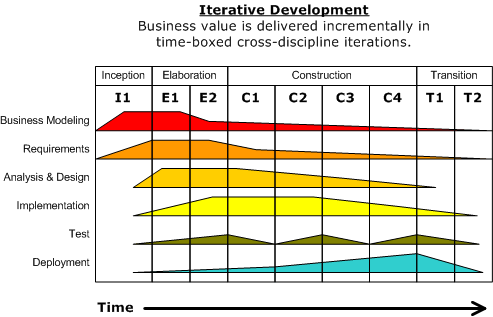

---
title:
- Metodologias de Desarrollo de Software
author:
- Medina Lopez, Jahir Gilberth
- Saavedra Jimenez, Lenin Sleyter
theme:
- Copenhagen
colortheme:
- dolphin
---

# Definición

Las metodologías nos indican un plan adecuado de gestión y control del proyecto de software : 
definición de etapas, ingresos y salidas, restricciones, comunicaciones, tareas ordenadas y 
distribución de recursos. 

De manera mas formal:

> [^derniame]Un modelo de procesos es una representación del mundo real, que captura el estado de actual de 
> las actividades para guiar, reforzar o automatizar partes de la producción de los procesos.

[^derniame]: Derniame, 1999

# Metodologias Clasicas

## Secuecial

Representado por metodologías tan famosas como Waterfall. Se inicia con un completo análisis de 
los requisitos de los usuarios. En el siguiente paso, los programadores implementan el diseño y 
finalmente, el completado y perfecto sistema es probado y enviado.

---


---

## Incremental

Su principal objetivo es reducir el tiempo de desarrollo, dividiendo el proyecto en intervalos 
incrementales superpuestos. Del mismo modo que con el modelo waterfall, todos los requisitos se 
analizan antes de empezar a desarrollar, sin embargo, los requisitos se dividen en “incrementos” 
independientemente funcionales.

---


--- 

## Iterativo

A diferencia del modelo incremental se centra más en capturar mejor los requisitos cambiantes y 
la gestión de los riesgos. En el desarrollo iterativo se rompe el proyecto en iteraciones de 
diferente longitud, cada una de ellas produciendo un producto completo y entregable.

---


---

# Metodolgias Orientadas a Objetos

## ICONIX 

En este contexto el proceso ICONIX[^1] se define como un “proceso” de 
desarrollo de software práctico. ICONIX está entre la complejidad del RUP[^2] y la simplicidad y 
pragmatismo del XP[^3], sin eliminar las tareas de análisis y de diseño que XP no contempla. 
ICONIX es un proceso simplificado en comparación con otros procesos más tradicionales, que 
unifican un conjunto de métodos de orientación a objetos con el objetivo de abarcar todo el 
ciclo de vida de un proyecto. 

[^1]: Creado por Rosenberg & Scott, 1993
[^2]: Rational Unified Processes
[^3]: Extreme Programming

---

### Características

Las tres características fundamentales de ICONIX son:

* Iterativo e incremental: Varias iteraciones ocurren entre el desarrollo del modelo del dominio y
la identificación
de los casos de uso. El modelo estático es incrementalmente refinado por los modelos dinámicos.
* Trazabilidad: Cada paso está referenciado por algún requisito. Se define trazabilidad como la 
capacidad de seguir una relación entre los diferentes artefactos producidos.
* Dinámica del UML: La metodología ofrece un uso “dinámico del UML” como los diagramas del caso de
uso, diagramas de secuencia y de colaboración.

---

### Etapas 

[^iconix]

1. Definición de Requirimientos
   - Modelado del Dominio
   - Modelado de los casos de uso
   - Revision de los Requerimientos
1. Analisis, Diseño Conceptual y Arquitectura Tecnica
    - Analisis de Robustes
    - Revision del diseño preliminar
    - Arquitectura Tecnica

1. Diseño y Programación 
    - Diagrama Secuencia
    - Revision del Diseño Critico
    - Implementacion
    - Revision de Codigo y Actualización del modelo
1. Pruebas y Seguimiento de Requerimientos
    - Pruebas Basadas en Diseño
    - Cumplir (Validar el Cumplimiento) de Requerimientos 

[^iconix]: Doug Rosenberg and Matt StephensUse Case Driven ObjectModeling with UMLTheory and Practice

---

# RUP

El *Proceso Unificado de Rational*[^rup] es un Proceso de Desarrollo de software iterativo, siendo un 
framework y metodología al mismo tiempo. Creado, Desarrollado y Matenido por IBM desde 2003 , RUP 
no es un sistema rigido de pasos sin embargo un marco de trabajo adaptable (es por esto que puede
ser visto como metdologia). RUP, al igual que ICONIX emplea una variante propia de UML.

[^rup]: Rational Unified Process

---



---

## Componentes Importantes

* Roles. Definir quien hace que.
* Productos a Trabajar/Obtener. Definir lo que genera cada rol.
* Tareas. Definir la forma en la que cada rol genera su producto.

## Etapas

* Creación o Planeamiento (Inception).
    - *Stakeholder Concurrence* [^stake]
    - Entendimiento de los Requerimientos
    - Veracidad de las estimaciones
        * Costo/tiempo
        * Prioridades
        * Riesgos
        * Procesos de Desarrollo
    - Alcance y Detalle de la Arquitectura Prototipo
    - Definir el estado actual del sistema.

[^stake]: Se define como la identificación de los puntos en comun de las areas mas importantes.

---

## Etapas

* Elaboración 
    - Modelo de Casos de Uso
    - Descripción de la Arquitectura
    - Planteamiento del plan de Desarrollo general
    - Prototipos Ejecutables o Pruebas de Concepto
    - Validación de Suficiencia

* Construccion
    - Si el proyecto es pequeño puede bastar con una sola iteracion, de lo contrario el numero de 
    iteraciones se debera haber previsto en la etapa anterior.

---

## Etapas

* Transicion.
    - Despliegue en producción.
    - Pruebas de Validacion
    - Comparación con el sistema previo
    - Validación del cumplimiento de expectativas.
    - Revision de la calidad del Producto

---

# XP (Extreme Programming)

Esta metodología busca mejorar la calidad y responsibidad al cambio de requerimientos. Es un tipo
de metodología ágil. Desarrollado por Kent Beck en marzo de 1996.

## Influencia

* Internamente, la Programación Orientada a Objetos.
* Externamente, El internet y los negocios online

---


---

## Características 

En el caso de XP , es una metodología orientada a priorizar las personas implicadas en el 
desarrollo y no el producto en si.

Teniendo asi , que en el libro original menciona como practicas primarias:

- Sentarse Juntos, Reunir a todo el equipo y hablar con cada uno de ser necesario
- Convertirse en un Equipo Unido
- Espacios de Trabajo con Información a mano.
- Trabajo Motivado y Eficiente
- Programación en pares.
- Emperajer Correctamente y Respetar el Espacio Personal

---

## Características 

- Historias como forma de control de avance
- Ciclos Semanales
- Trabajo Modular 
- Descansos
- Integración/Compilación cada 10 minutos
- Integración Continua
- Programación que prioriza el ```testeo```
- Diseño Incremental

---

## Flujograma del Trabajo


---

## Flujograma del Trabajo


--- 

# Referencias

* Derniame, J (1999)
  Software Process: Principles, Methodology, Technology.
  Lecture Notes in Computer Science 1500 Springer 1999, 
  ISBN 3-540-65516-6 BibTeX
  A Discipline of Programming.


* [Espinoza, A (2013).](https://pirhua.udep.edu.pe/bitstream/handle/11042/2747/ING_521.pdf?sequence=1&isAllowed=y)
  Manual para elegir una metodología de desarrollo de 
  software dentro de un proyecto informático.
  Facultad de Ingeniería, Universidad de Piura.
  Piura Perú.

* [Gacitúa, R (2003).](https://www.redalyc.org/pdf/299/29901203.pdf)
  METODOS DE DESARROLLO DE SOFTWARE: EL DESAFIOPENDIENTE DE LA ESTANDARIZACION
  Depto. Sistemas de Información, Facultad de Ciencias Empresariales, Universidad del Bío-Bío, 
  Avda. Collao 1202,Concepción, Chile.
 
---

* [Amavizca, L & et.al (2014).](http://www.laccei.org/LACCEI2014-Guayaquil/RefereedPapers/RP246.pdf)
  Aplicación de la metodología semi-ágil ICONIX para el desarrollo de software:
  implementación y publicación de un sitio WEB para una empresa SPIN - OFF en el
  Sur de Sonora, México. 
  Twelfth LACCEI Latin American and Caribbean Conference for Engineering and Technology (LACCEI’2014)

* Rosenberg, D & Stephens, M. (2007)
  Use Case Driven Object Modeling with UML: Theory and Practice.
  Apress. (ISBN 1590597745)

---

* [Mark Aked (2003).](https://www.ibm.com/developerworks/rational/library/1826-pdf.pdf)
  Risk reduction with the RUP phase plan
  developerWorks, IBM.

* Kruchten, P (2000).
  The Rational Unified Process An Introduction, Second Edition
  Addison WesleySecond Edition March 14, 2000ISBN: 0-201-70710-1, 320 pages

---

* Beck, K. (1999). 
  Extreme Programming Explained: Embrace Change. 
  Addison-Wesley. ISBN 978-0-321-27865-4.
