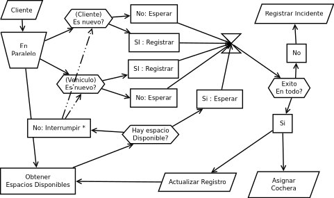

>> # Análisis del Caso "*Mi Cochecito*"

____
**Autor**

~~~
Medina Lopez, Jahir Gilberth
964699016
me@jahirmedina.com
~~~

**Palabras Clave** 

~~~
Análisis , Organigrama, Caso Práctico, Toma de Requerimientos
~~~

___
## Análisis

Es importante considerar que al leer el caso, existirán dos tipos de requerimientos : los explícitos
y los implícitos. Si bien existirían requerimientos derivados de unos u otros, es importante agruparlos
dentro de requerimientos implícitos, pues su existencia deriva de los requerimientos expresos dados
por el cliente.


### Requerimientos Explícitos

1. Generar un registro de los clientes
2. Generar un registro de los vehículos estacionados (en el garaje)
3. Poder Determinar la relación vehiculo-cliente y obtener los datos personales del mismo
4. Evento Condicional: Al llegar un vehículo,
    - Si es *cliente nuevo* ; Crear una ficha personal, conteniendo:
        * nombre
        * apellido
        * domicilio
        * sexo
        * email
        * teléfono
        * fecha de cumpleños
5. Crear una ficha del automóvil, conteniendo:
    - marca
    - modelo
    - año
    - color
    - tipo de vehículo
6. **Importante** : Saber con precisión que cocheras están disponibles u ocupadas, 
    - Si está ocupado: Saber en qué piso y número de cochera

#### Consideraciones en el Caso:
- Se usará como clave única para los vehículos su placa de tránsito y para los clientes su número de 
documento (DNI).
- Un cliente puede tener más de un vehículo, pero todo vehículo tiene solo un dueño.
- Las marcas de los vehículos se encuentran codificadas:
    * Fiat
    * Honda
    * Renault
    * Suzuki
    * ```etc```
- Los tipos están codificados:
    * auto pequeño
    * auto mediano
    * auto grande
    * camioneta
    * furgón
    * ```etc```

### Requerimientos Implícitos

1. Si el cliente llega y ya se encuentra registrado, verificar si su vehículo se encuentra registrado
o es uno nuevo
2. Añadir una excepción del tipo ```otra marca``` en caso llegará un vehículo no codificado.
3. Añadir una excepción del tipo ```otra denominación``` en caso llegar un vehículo de tipo no codificado 
4. Validar las placas de tránsito y los DNI (Cantidad de dígitos y formato de registro)

### Discusión, ¿Por qué es importante considerar los requerimientos calificados como ***importantes*** por el cliente?

En nuestro caso particular el cliente considero importante:

~~~
> Saber con precisión que cocheras están disponibles u ocupadas 

> Si está ocupado: Saber en qué piso y número de cochera
~~~

Al momento de ordenar la prioridad de los módulos, se deberá priorizar la sostenibilidad, migración y resiliencia
del módulo que solvente los requerimientos marcados como importantes, pues, podría no registrar un cliente
o registrarse de forma tardía el tipo de vehículo, sin embargo; tener marcado como ocupado una cochera
vacía es perder dinero, tener marcado como desocupado una cochera ocupada es malestar para el cliente.

En estos escenarios es importante valorar la solicitud del cliente, pues el conoce a su clientela.
Ignorar el dominio de conocimiento del cliente para priorizar nuestras aprensiones respecto al sistema
en gran mayoría de los casos concluye en un producto que podría cubrir las necesidades planteadas, no
consigue adecuarse a todos los casos de uso.

___ 
## Organigrama



Este organigrama organiza los eventos en un formato de eventos. Como es claro, no se ajusta a ningún
modelo especifico mas sin embargo modela el funcionamiento del sistema considerando los requerimientos.

### Procesos Considerados

#### Registrar

El proceso de registrar puede ser modelado como un módulo completo y único, con posibilidad de ser replicado
para poder funcionar en paralelo.
En este caso, como el proceso de registro del vehículo implica datos que pueden ser obtenidos con la
inspección visual, se puede ejecutar en paralelo que la toma o validación de datos del cliente.

Para el caso del Cliente, es importante verificar si es nuevo o no, para evitar duplicación de registros
aunque esto puede ser controlado por el módulo.

#### Obtener Espacios Disponibles

Este proceso es un proceso ***persistente***, significa que se encuentra presente en todo momento,
y si por algún motivo fallara, deberá ser repuesto en la brevedad posible.

Este proceso tiene la capacidad de detener el proceso de ```registro```, más como se puede ver en el 
gráfico, el asterisco simboliza que es opcional. Pudiendo , bajo discreción del personal operario
del sistema continuar o detener el registro/validación del cliente.

Es importante este proceso se ejecute siempre en paralelo al registro, supongamos, por algún motivo, un
cliente llega a registrarse cuando no hay espacios disponibles, ¿que se debería hacer?, ¿suspender todo
el proceso de registro?, ¿esperar se desocupe un espacio?. Estás situación solo podría ser contestado 
teniendo al proceso que lleva el contable de los espacios disponibles siempre en ejecución.

#### Registrar Incidente

Mi planteamiento está basado en un modelo basado en eventos, por tanto no existen transacciones canceladas.
Por lo que de no concretarse la operación, se registrará los datos parciales obtenidos hasta el momento.

Esto servirá para que el sistema no tenga fuga de datos, los cuales servirán para futuros Análisis 
estadísticos , económicos o contables.

#### Asignar Cochera / Actualizar Registro

Estos procesos son derivados del modulo Registrar Incidente, solo que en estos se garantiza el registro
de datos completos y no parciales. Un grupo de datos para registrar el alquiler de cochera y otro
para actualizar la lista de espacios disponibles.

___
## Conclusiones

Modelar un sistema puede parecer fácil si sólo se considera los requerimientos explícitos, más si se
trabaja todo como eventos completos: Sucede o no.

En la vida real, los sistemas son dinámicos, y más los que involucran personas. Considerar esto debe 
primar al modelar los procesos, tratarlos como eventos y no como acciones. Un evento puede suceder 
al mismo tiempo que varios, llamar a otro evento en ejecución , cancelarlo o detener en mitad de ejecución,
sin embargo esto no lo haría un proceso errado.

Para el siglo 21 la data es oro, modelar sistemas con procesos que registren la mayor cantidad de estados
debe ser la norma, pues cada vez son más empresas las que requieren inteligencia de negocios.
___

## Referencias

* Roger S. Pressman, “Ingeniería del software Un enfoque práctico”, 7ma edición, México, McGraw-Hill, 2010, 777, 1
* Martin Fowler, "Event Sourcing", https://martinfowler.com/eaaDev/EventSourcing.html, 2005
* Greg Young, "Design Patterns: Why Event Sourcing?", Dutch PHP Conference, https://www.youtube.com/watch?v=rUDN40rdly8, 2016


