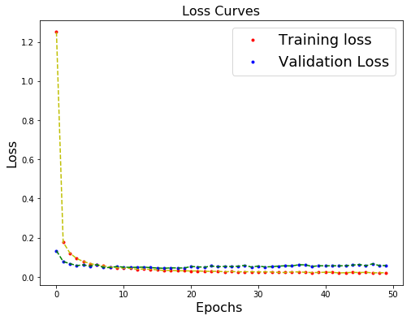
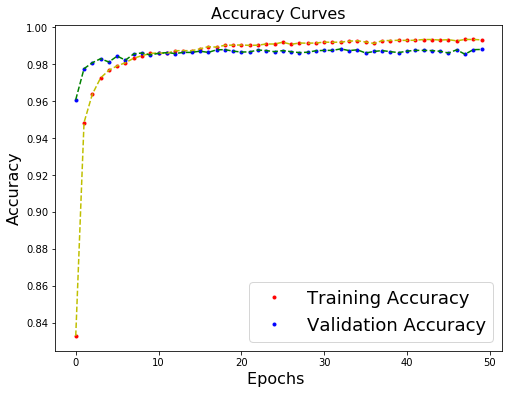
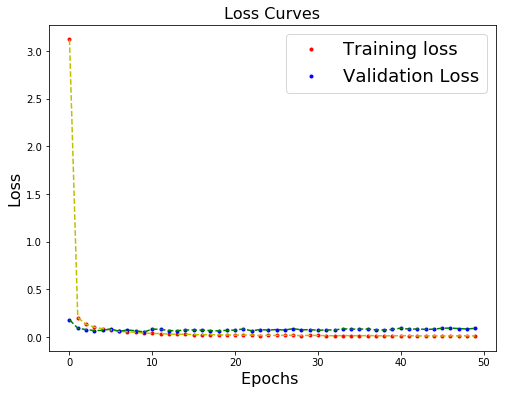
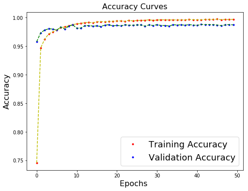
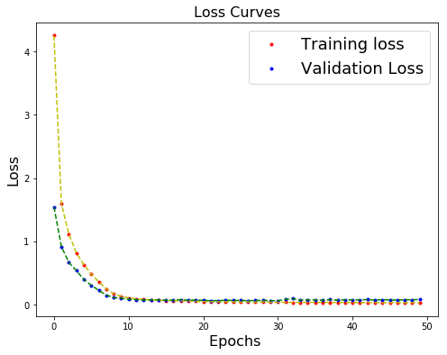
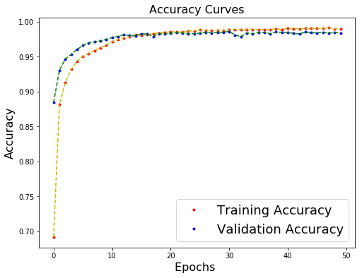
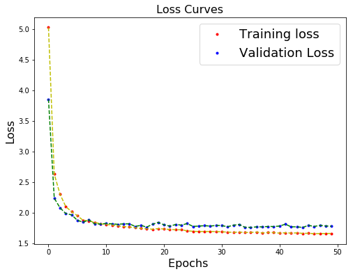
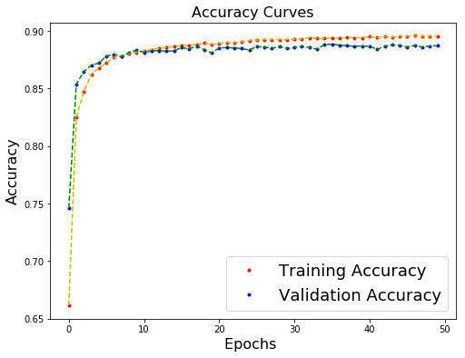
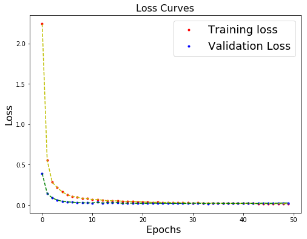
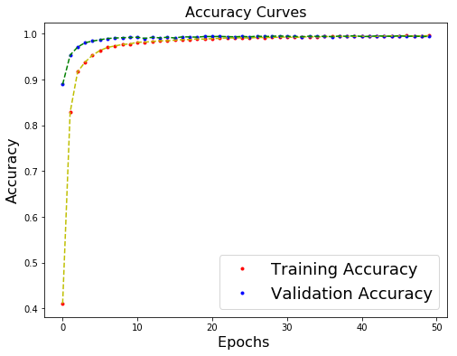

# MNIST

* Jahir Gilberth Medina Lopez
    - **USP# 10659682**

## Introduction

O uso de cnn tornou-se mais comum nos últimos anos no campo da visualização computacional. Sua principal característica reside na geração automática de filtros, além de sua detecção automática de padrões.

## Predictions

Como pode ser visto no anexo de demonstração nesta pasta, a precisão da predição depende muito do modelo usado.

Se usarmos o modelo overfitting (v0), as previsões têm alguns erros, mas se usarmos o modelo mais "plástico" (v4), as previsões se tornam altamente precisas, mesmo em alguns casos sem erros nas previsões.

## Models Used

### v1

* **epochs** : *50*
* **batch_size** : *500*
* **optimizer** : *adadelta*
* **loss** : *categorical_crossentropy*
* **metrics** : *accuracy*

|       | Neurons/Size  | Filter Size   | Activation    | Dropout   | Max-Pooling   |    Layer Type     |
|:--:   |:------------: |:-----------:  |:----------:   |:-------:  |:-----------:  |:----------------: |
|  0    |    28x28x3    |      -        |      -        |    -      |      -        |    Input Layer    |
|  1    |      32       |     3x3       |    Relu       |   0.0     |      -        | 2D Convolutional  |
|  2    |      28       |     2x2       |    SeLu       |   0.2     |      -        | 2D Convolutional  |
|  3    |       -       |      -        |      -        |    -      |     2x2       |      Pooling      |
|  4    |    Flatten    |      -        |      -        |    -      |      -        |  Fully Connected  |
|  5    |      10       |      -        |   SoftMax     |   0.0     |      -        |   Output Layer    |

### v2

* **epochs** : *50*
* **batch_size** : *1000*
* **optimizer** : *adadelta*
* **loss** : *categorical_crossentropy*
* **metrics** : *accuracy*

|       | Neurons/Size  | Filter Size   | Activation    | Dropout   | Max-Pooling   |    Layer Type     |
|:--:   |:------------: |:-----------:  |:----------:   |:-------:  |:-----------:  |:----------------: |
|  0    |    28x28x3    |      -        |      -        |    -      |      -        |    Input Layer    |
|  1    |      32       |     3x3       |    Relu       |   0.0     |      -        | 2D Convolutional  |
|  2    |      28       |     2x2       |    SeLu       |   0.2     |      -        | 2D Convolutional  |
|  3    |       -       |      -        |      -        |    -      |     2x2       |      Pooling      |
|  4    |    Flatten    |      -        |      -        |    -      |      -        |  Fully Connected  |
|  5    |      10       |      -        |   SoftMax     |   0.0     |      -        |   Output Layer    |

### v3

* **epochs** : *50*
* **batch_size** : *1000*
* **optimizer** : *adadelta*
* **loss** : *categorical_crossentropy*
* **metrics** : *accuracy*

|       | Neurons/Size  | Filter Size   | Activation    | Dropout   | Max-Pooling   |    Layer Type     |
|:--:   |:------------: |:-----------:  |:----------:   |:-------:  |:-----------:  |:----------------: |
|  0    |    28x28x3    |      -        |      -        |    -      |      -        |    Input Layer    |
|  1    |      20       |     2x2       |    Relu       |   0.0     |      -        | 2D Convolutional  |
|  2    |      10       |     2x2       |    SeLu       |   0.2     |      -        | 2D Convolutional  |
|  3    |       -       |      -        |      -        |    -      |     2x2       |      Pooling      |
|  4    |    Flatten    |      -        |      -        |    -      |      -        |  Fully Connected  |
|  5    |      10       |      -        |   SoftMax     |   0.0     |      -        |   Output Layer    |

### v4

* **epochs** : *50*
* **batch_size** : *1000*
* **optimizer** : *adadelta*
* **loss** : *categorical_crossentropy*
* **metrics** : *accuracy*

|       | Neurons/Size  | Filter Size   | Activation    | Dropout   | Max-Pooling   |    Layer Type     |
|:--:   |:------------: |:-----------:  |:----------:   |:-------:  |:-----------:  |:----------------: |
|  0    |    28x28x3    |      -        |      -        |    -      |      -        |    Input Layer    |
|  1    |      25       |     2x2       |    Relu       |   0.0     |      -        | 2D Convolutional  |
|  2    |      20       |     2x2       |    ReLu       |   0.1     |      -        | 2D Convolutional  |
|  3    |       -       |      -        |      -        |    -      |     2x2       |      Pooling      |
|  4    |    Flatten    |      -        |      -        |    -      |      -        |  Fully Connected  |
|  5    |      10       |      -        |   SoftMax     |   0.0     |      -        |   Output Layer    |

### v0 (Overfitting)

* **epochs** : *50*
* **batch_size** : *1000*
* **optimizer** : *adadelta*
* **loss** : *categorical_crossentropy*
* **metrics** : *accuracy*

|       | Neurons/Size  | Filter Size   | Activation    | Dropout   | Max-Pooling   |    Layer Type     |
|:--:   |:------------: |:-----------:  |:----------:   |:-------:  |:-----------:  |:----------------: |
|  0    |    28x28x3    |      -        |      -        |    -      |      -        |    Input Layer    |
|  1    |      36       |     3x3       |    Relu       |   0.0     |      -        | 2D Convolutional  |
|  2    |      36       |     2x2       |    SeLu       |   0.2     |      -        | 2D Convolutional  |
|  3    |       -       |      -        |      -        |    -      |     2x2       |      Pooling      |
|  4    |      48       |     2x2       |    SeLu       |   0.0     |      -        | 2D Convolutional  |
|  5    |      48       |     4x4       |    ReLU       |   0.3     |      -        | 2D Convolutional  |
|  6    |       -       |      -        |      -        |    -      |     2x2       |      Pooling      |
|  7    |      500      |      -        |    SeLu       |   0.8     |      -        |  Fully Connected  |
|  8    |      300      |      -        |    ReLU       |   0.4     |      -        |  Fully Connected  |
|  9    |      10       |      -        |   SoftMax     |   0.0     |      -        |   Output Layer    |

