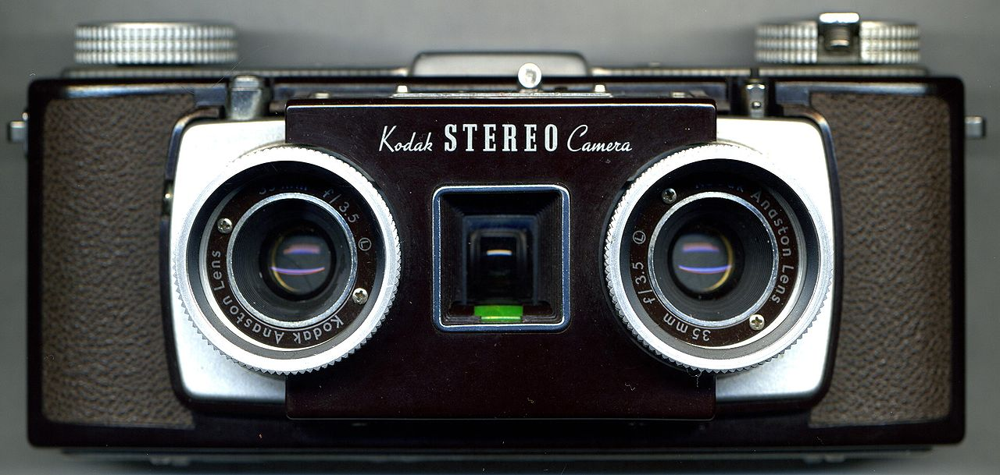
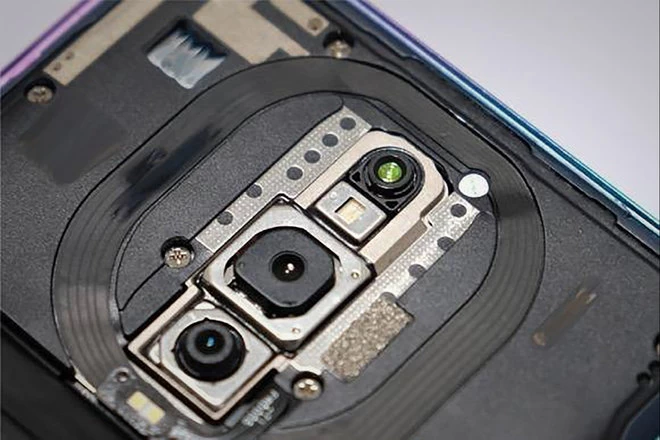
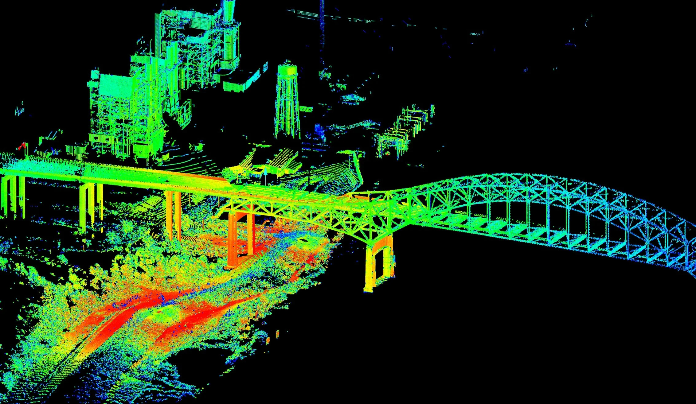
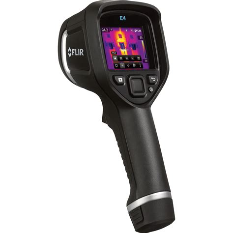
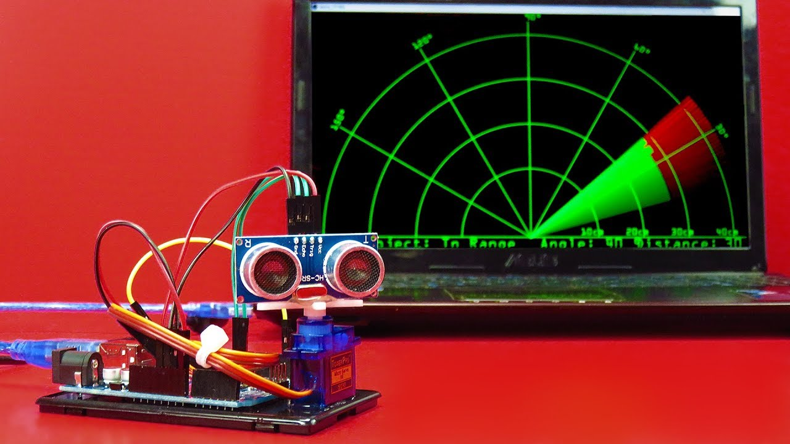
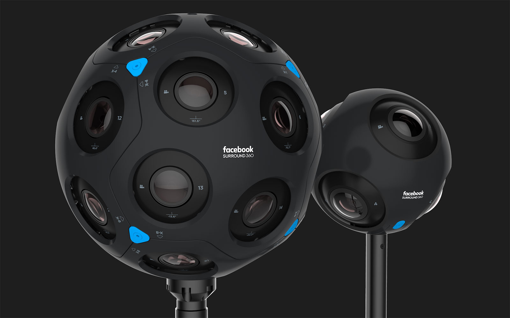
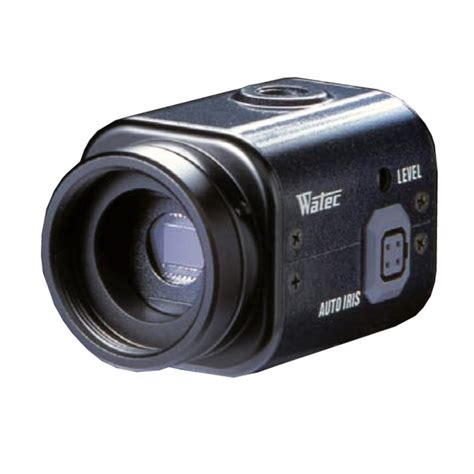
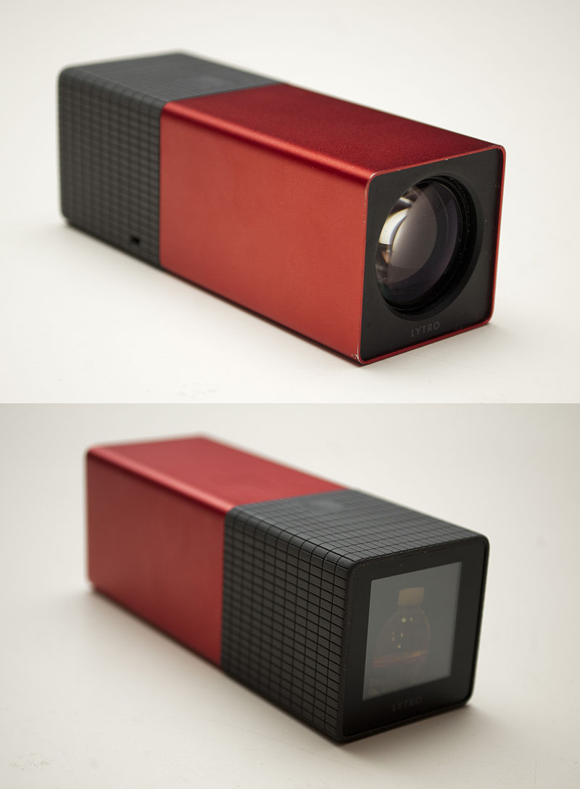

# Actividad 1

Investigue los diversos tipos de hardware involucrados en un sistema de
visión computacional, descríbalos, indique sus componentes, indique su
ubicación dentro de los sistemas y subsistemas de un sistema de visión
computacional, y compárelos.

## Desarrollo

### Camara Estereoscopica

La Camara Estereoscopica es una camara compuesta por 2 (o mas sensores) espaciados por una 
distancia especifica, de forma que pueda simular o aproximar la vision humana.
Esto 

### Sensor de Profundidad (ToF)

El sensor de profundidad utiliza un emisor de rayos infrarojos y detector de estos, calibrado para
una frecuencia especifica , de forma que pueda medir el *tiempo de vuelo* (ToF) y asi calcular 
la distancia a la que se encuentra el objetivo a ser fotografiado o detectado.

### LIDAR

El LIDAR son las siglas de *laser imaging, detection, and ranging* , en español *imagen laser, 
deteccion y medicion* , es una imagen construida al emitir muchos pulsos laser y medir su tiempo
de retorno para construir una nube de puntos, mientras el sensor de profundidad usa un solo diodo
infrarojo y un sensor para medir la distancia, el LIDAR utiliza lasers de alta precision para 
generar una nube de puntos y construir asi una superficie tridimensional.

### Camara Infraroja

La camara infraroja 

### Radar de Ultrasonido

### Camara 360

### Camara monocromatica de alta sensibilidad 

### Camara de Campo Luminico

# Actividad 2

Investigue aplicaciones de visión computacional innovadoras y
resaltantes, descríbalas, y resalte las ventajas, desventajas y describa
donde se aplica o podría aplicar en nuestro país o región indicando los
efectos que esto podría ocasionar.

# Actividad 3

Investigue los diversos formatos de archivo de imagen y descríbalos
resaltando sus ventajas y desventajas.

# Actividad 4

Leer artículo Machine Learning in Computer Vision y elaborar un
organizador visual.
